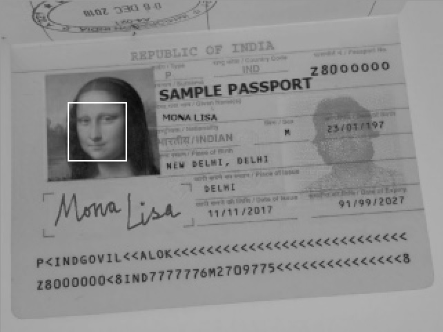
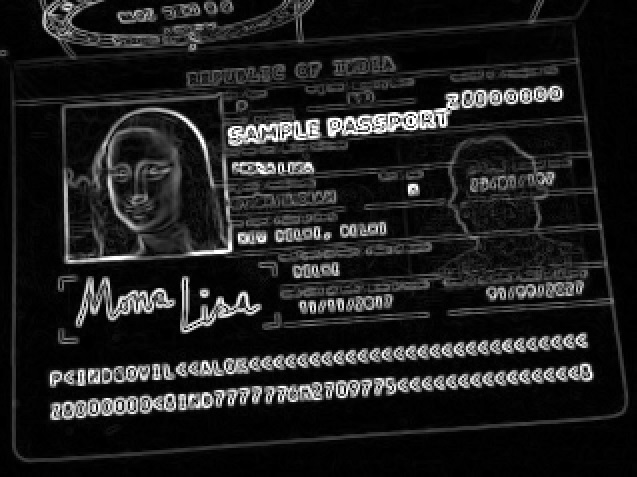
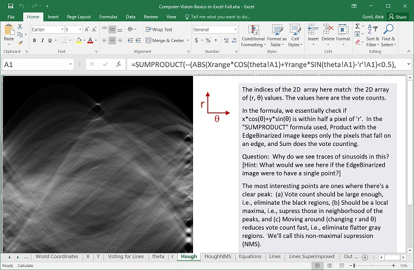
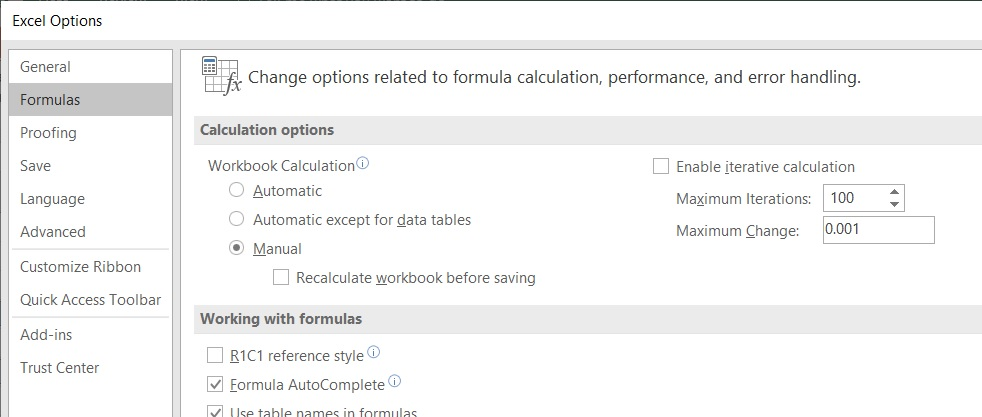

# Computer Vision Basics in Microsoft Excel 

By [Alok Govil](https://www.linkedin.com/in/alokgovil/), Principal Engineer, Amazon

Collaborator: [Venkataramanan Subramanian](https://www.linkedin.com/in/venkataramanansubramanian/), Principal Engineer, Amazon

Computer Vision is often seen by software developers and others as a hard field to get into.  In this blog, we'll learn Computer Vision from basics using sample algorithms implemented within Microsoft Excel, using a series of one-liner Excel formulas.  We'll use a surprise trick that helps us implement and visualize algorithms like Face Detection, Hough Transform, etc., within Excel, with no dependence on any script or a third-party plugin.

Outline of the steps to visualize a spreadsheet as an image

## Feedback quotes

>"Its amazing to see an image show up on the Excel sheet as you zoom out and numbers appear as you zoom back in."

>"Very cool to see that with 'simple' Excel formulas you can do some real computer vision."

>"... used Excel to explain the core concepts and algorithms so clear that I feel I could start working with it right now! ..."

## Preview of what we'll achieve

We will see how to detect a face using a toy example:

We will also see how to find edges and lines:

## Expectations from the audience

No prior background in Computer Vision should be needed to follow the material.  It is assumed that the audience knows Microsoft Excel basics and can read its documentation, or search online for interpreting the formulas used.  [Exceljet](https://exceljet.net/) is a great resource for the latter.

Some mathematical understanding would be needed:  Those who won't know what weighted average is won't be able to follow much.  Understanding of partial derivatives would be helpful but not required.  Most complex mathematical concept used is [eigenvalues](https://en.wikipedia.org/wiki/Eigenvalues_and_eigenvectors), but again the readers should be able to follow even if they do not know or remember the same.

## Downloads

The Excel files, available below for downloading, are self-explanatory with notes inserted within.  Please follow the sheets step-by-step.

The work was done using Excel 2016 on Windows; it should however open in other versions of Excel.

### Instructions

Before opening the Excel file(s), change Excel Formula Calculation to "Manual" since some calculations (Hough Transform specifically) are time-consuming (say an hour). Then trigger recalculation manually as per need.

Also, uncheck "Recalculate workbook before saving", else Excel will recalculate all the formulas every time you save the files.

Note:  Be sure to revert these settings once you are done.

Those familiar with R1C1 formula reference style in Excel, or those adventurous, should try switching to it by looking in Excel options and turning it on.  See the screenshot below and check the box to enable it.  This changes the formulas from "D5" type format to a relative style like "R[-1]C[2]" (absolute references also allowed as "R4C5" for example), bringing it closer to programming languages and aiding understanding.

### The Excel files

Contents|File|Description
--------|----|-----------
The full Excel File|[Computer-Vision-Basics-in-Excel.xlsx](Computer-Vision-Basics-in-Excel.xlsx)|The file is, unsurprisingly, heavy for Excel.  Be patient with it. :-)  Even if it goes busy for an hour, Excel usually does finish up and come back.
Part 0|[Computer-Vision-Basics-in-Excel-0-Introduction-and-Outline.xlsx](Computer-Vision-Basics-in-Excel-0-Introduction-and-Outline.xlsx)|
Introduction and Outline: Start here if following the individual parts.

Part 1|[Computer-Vision-Basics-in-Excel-1-Edges-and-Lines.xlsx](Computer-Vision-Basics-in-Excel-1-Edges-and-Lines.xlsx)|
Edges and Lines: One of the sheets in this file, named "Hough", is very compute-intensive.

Part 2|[Computer-Vision-Basics-in-Excel-2-Keypoints-and-Descriptors.xlsx](Computer-Vision-Basics-in-Excel-2-Keypoints-and-Descriptors.xlsx)|
Corners/Keypoints: We do not go into the details of these.

Part 3|[Computer-Vision-Basics-in-Excel-3-Face-Detection.xlsx](Computer-Vision-Basics-in-Excel-3-Face-Detection.xlsx)|
Face Detection: Functional face detection demo on the specific input image using (simplified) Viola-Jones object detection framework.

Part 4|[Computer-Vision-Basics-in-Excel-4-Text.xlsx](Computer-Vision-Basics-in-Excel-4-Text.xlsx)|
Character Recognition: A toy example that recognizes uppercase E's in the image.

## Questions and Answers

Many of the following would make sense only after going through the Excel files above.

### Q1:  What software do I need to open the *.xlsx files?

The work was done using Excel 2016 on Windows; it should however open in other versions of Excel.

While the files open in [LibreOffice](https://www.documentfoundation.org/) (tested in version 6.4.0.3 (x64)), it is slow to the level of being unusable.  We have not tested in [Apache OpenOffice](https://www.openoffice.org/).

### Q2:  How was the image data imported into Excel?

You can follow this blog: https://alvinalexander.com/blog/post/java/getting-rgb-values-for-each-pixel-in-image-using-java-bufferedi and output data into a [CSV file](https://en.wikipedia.org/wiki/Comma-separated_values) which Excel readily opens.

Here are two more images imported into Excel, ready for use: [Einstein](Image-Einstein.xlsx), [Pillars](Image-Pillars.xlsx).  Note that the Face Detection parameters used in the Excel files above would likely fail to detect Einstein's face as the Haar-like features were fine-tuned by hand for detecting Mona Lisa's face in just that image.  However, the method can again be easily fine-tuned for Einstein's face, AND, when the parameters are [calculated using Machine Learning](https://en.wikipedia.org/wiki/Viola%E2%80%93Jones_object_detection_framework#Components_of_the_framework), it works on most frontal-looking faces (assuming not occluded, not too small, etc.).  See question #7 below for further details on this.

### Q3:  Why was the green channel of the image used, and not red or blue?  How can I represent color images in Excel in this fashion?

Of the three primary color channels, red, green and blue, green contributes the most to luminosity.

Ideally, the image should be converted to grayscale first, or luminosity values should be computed (see [here](https://en.wikipedia.org/wiki/CIE_1931_color_space)).  This was skipped just for simplicity of explanation.

One way of representing color images in Excel is referenced in the answer to the question #8 below.

### Q4:  Are the techniques presented still relevant, or are they replaced by deep neural networks?

The techniques are still very relevant.  Neural networks are taking over for all complex computer vision problems, especially those unsolved by the classical techniques.  For simpler operations, the classical solutions are faster to put together and are computationally more efficient.  Also, classical techniques are still the default choice for edge devices (smartphones, web clients) though modern techniques are making an entry notably via hardware acceleration (e.g., [1](https://petewarden.com/2018/06/11/why-the-future-of-machine-learning-is-tiny/), [2](https://petewarden.com/2019/04/14/what-machine-learning-needs-from-hardware/)).

### Q5:  In the OCR example, how do you chose the mask and its orientation?

For document [OCR](https://en.wikipedia.org/wiki/Optical_character_recognition) (as opposed to [scene text](https://en.wikipedia.org/wiki/Scene_text) recognition), the document itself is typically straightened first before character recognition is performed for the characters in the document. Therefore, the characters are expected to be nearly upright.

In the talk, a toy example was shown using a [single convolutional](https://en.wikipedia.org/wiki/Convolutional_neural_network) neuron to recognize an 'E'.  Neural networks use a number of layers of neurons for the task to recognize all characters of interest.  The same neural network then outputs which character is present at the input.  You can imagine this as having a separate simple neural network like for 'E' for recognizing each character of interest.  The combined neural network would, however, have several neurons shared in the path for recognizing each character.

See also the Q&A below for more on character recognition.

### Q6:  How well does the OCR approach here work on different fonts?

In the talk, we used a single [convolutional neuron](https://en.wikipedia.org/wiki/Convolutional_neural_network) to identify an uppercase 'E' as an example.  The actual systems still commonly use neural networks (not just a single neuron) for the purpose, and that performs well across fonts and languages.  Some additional details are present below:

In the talk, a single neuron was used to both scan the image and recognize the letter.  Typically, scanning text of different sizes is done separately using various methods.  Once every character of text is isolated, it is re-scaled to a fixed size and then a neural network is used to identify the letter.

Handwriting recognition is harder, unsurprisingly.  The best performance is reached when the pen strokes data is available as a function of time (e.g., when recognizing handwriting input on a touch-screen).  References are readily available online for further reading.

In the example shown in the talk, even the weights of that single neuron were hand-crafted, not actually learned using a training algorithm.  Even a single neuron would do better that the demo when actually trained.

### Q7:  Why was the watermark face on the ID not detected and yet Mona Lisa's was?

We demonstrated the core concept of [a popular face detection algorithm](https://en.wikipedia.org/wiki/Viola%E2%80%93Jones_object_detection_framework) using just three [Haar-like features](https://en.wikipedia.org/wiki/Haar-like_feature) and two stages, which were hand-crafted to detect the face of Mona Lisa in that specific image.  The actual features as well as the stages are in practice calculated using Machine Learning, which commonly results in a few thousands of such features, as well as over ten stages.  Then the system is able to detect over 99% of the nearly frontal looking faces (while a separate pre-trained model is available for faces looking nearly sideways in [OpenCV](https://en.wikipedia.org/wiki/OpenCV)).

The face shadow on the right would still be missed by the algorithm since such face images are not included in the training data.  My educated guess further will be that to detect such shadowed faces, the algorithm described would not do a good job, and using neural networks would be recommended.  Likewise, the algorithm we demonstrated is outperformed by a neural networks for "[Labeled faces in the wild](http://vis-www.cs.umass.edu/lfw/)" dataset where faces are often partially occluded too.

### Q8:  How did you come up with the idea for using Microsoft Excel for this?

About 1.5 years back, we had to give an introductory talk on Computer Vision to a wide audience within Amazon, many of whom would have been completely unfamiliar with the subject.  We thought about starting from the very basics by showing that an image is essentially a 2D array of numbers (for each color channel for color images) and thought about showing these using Excel.

"Hmm!  If the numbers are in Excel, I could do more with it" ... You get the idea. :-)

It took about seven hours to create the first version for that talk, which did not include Face Detection and Text recognition.  The latter took about eight more hours for the first version.

We have since then discovered several related works that represent images in Excel using this technique:

* Images in Excel Spreadsheet (including color):  [Stand-up comedy routine about Spreadsheets](https://www.youtube.com/watch?v=UBX2QQHlQ_I)
* Ray-tracing in Excel:  [The latest thing to support ray tracing is Excel, apparently](https://www.pcgamer.com/the-latest-thing-to-support-ray-tracing-is-excel-apparently/)
* 3D Engine in Excel:  [Real 3D Engine - in Excel!!](https://www.youtube.com/watch?v=bFOL9kantXA)
* 3D Graphics in Excel:  [Microsoft Excel: Revolutionary 3D Game Engine?](https://www.gamasutra.com/view/feature/131968/microsoft_excel_revolutionary_3d_.php)

### Q9:  Are there specialized interactive developer environments for Computer Vision?

[Matlab](https://www.mathworks.com/products/matlab.html) is often used for this as it has many Computer Vision functions built-in natively or in toolboxes.  Function "imshow" can be used to instantly display array data as an image.

Python- and Notebooks-based tooling is also very popular.

### Q10:  Is that your passport information on the slides?

All the critical information in the image has been changed like passport number, signatures, etc., including in the machine-readable lines at the bottom of the image.

### Q11:  Why does Hough Transform show artifacts for +/- 45°?

Please refer to the answer here: https://stackoverflow.com/questions/33983389/hough-line-transform-artifacts-at-45-degree-angle

## Additional Resources and References

### Books

Below are two freely-downloadable good books on classical Computer Vision (i.e., before deep learning came into the field):

* [Computer Vision: Algorithms and Applications](http://szeliski.org/Book/), Richard Szeliski (2010): This books provides a summary of many computer vision techniques along with research results from academic papers.  The diagrams in the book by themselves are worth browsing through to understand the state of the art in the field till 2010 when the book was published.  The book usually does 'not' give enough detail to allow someone to implement the methods described, though appropriate references are cited.
* [Computer Vision Metrics](https://link.springer.com/book/10.1007%2F978-1-4302-5930-5): Survey, Taxonomy, and Analysis, Scott Krig (2014): This book provides a good top-level view of computer vision, though often mixed on details.

For practical implementation, there are many books on OpenCV, a common Computer Vision library like [Learning OpenCV 3: Computer Vision in C++ with the OpenCV Library](http://shop.oreilly.com/product/0636920044765.do), Gary Bradski, Adrian Kaehler

### Selected Articles and Blogs

* Corner detection: See https://en.wikipedia.org/wiki/Harris_Corner_Detector.  Also see other corner-detection algorithms like [FAST](https://en.wikipedia.org/wiki/Features_from_accelerated_segment_test).
* The following blog talks about feature descriptors very commonly used in Computer Vision: [A short introduction to descriptors](https://gilscvblog.com/2013/08/18/a-short-introduction-to-descriptors/) and [Tutorial on binary descriptors](https://gilscvblog.com/2013/08/26/tutorial-on-binary-descriptors-part-1/).
* This blog talks about how feature descriptors are used in a sample application: [Image Alignment (Feature Based) using OpenCV (C++/Python)](https://www.learnopencv.com/image-alignment-feature-based-using-opencv-c-python/)

## License Summary

Copyright 2018-20 Amazon.com, Inc. or its affiliates. All Rights Reserved.  SPDX-License-Identifier:  CC-BY-NC-SA-4.0

This work is made available under the Creative Commons Attribution-NonCommercial-ShareAlike 4.0 International Public License.  See the [LICENSE](LICENSE) file.  It cannot be used for commercial training or lectures.
